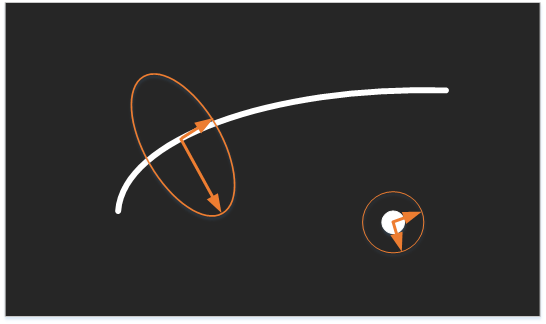

#【图像处理】 海森矩阵 
[TOC]

## 导论

##海森矩阵的意义
众所周知，二阶导数表示的导数的变化规律，如果函数是一条曲线，且曲线存在二阶导数，那么二阶导数表示的是曲线的曲率，曲率越大，曲线越是弯曲。以此类推，多维空间中的一个点的二阶导数就表示该点梯度下降的快慢。以二维图像为例，一阶导数是图像灰度变化即灰度梯度，二阶导数就是灰度梯度变化程度，二阶导数越大灰度变化越不具有线性性（这里有一点绕口了，意思就是这里灰度梯度改变越大，不是线性的梯度）。

但是在二维图像中，海森矩阵是二维正定矩阵，有两个特征值和对应的两个特征向量。两个特征值表示出了图像在两个特征向量所指方向上图像变化的各向异性。如果利用特征向量与特征值构成一个椭圆，那么这个椭圆就标注出了图像变化的各向异性。那么在二维图像中，什么样的结构最具各项同性，又是什么样的结构的各向异性更强呢？很显然，圆具有最强的各项同性，线性越强的结构越具有各向异性。如下图:

 

  

## 泰勒展开及海森矩阵
将一个一元函数f(x)在x0处进行泰勒展开，可以得到以下公式。
 
$$f(x_0 + \delta x) = f(x_0) + \delta x * f'(x_0) + \frac{1}{2！} \delta x^2 * f''(x_0) + o \Vert \delta x^2 \Vert$$

其中余项为皮亚诺余项。

       其中二阶导数的部分映射到二维以及多维空间就是Hessian Matrix。在二维图像中，假设图像像素值关于坐标（x, y）的函数是f(x, y)，那么将f(x+dx，y+dy)在f(x0, y0)处展开,得到如下式子；

     如果将这个式子用矩阵表示，并且舍去余项，则式子会是下面这个样子。

      上面等式右边的第三项中的第二个矩阵就是二维空间中的海森矩阵了；从而有了一个结论，海森矩阵就是空间中一点处的二阶导数。进而推广开来，多维空间中的海森矩阵可以表示为。

